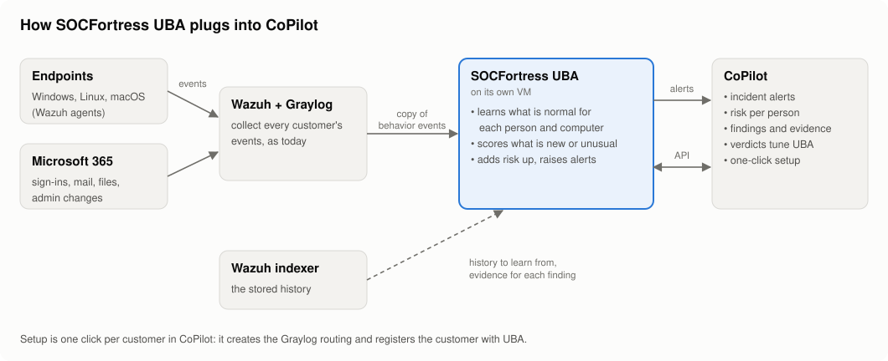
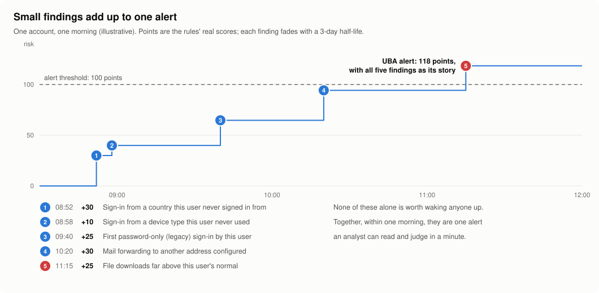
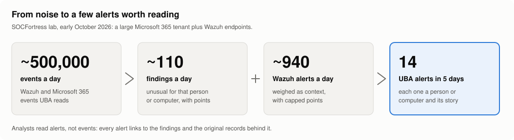

# SOCFortress UBA

**User Behavior Analytics for SOCFortress CoPilot.** UBA learns how each person and computer
normally behaves, from the Wazuh and Microsoft 365 data CoPilot already collects, and raises an alert
when the unusual things it notices add up. Analysts read a handful of alerts that each tell a story,
instead of thousands of events.

This repository is everything needed to run it: a Docker Compose file that pulls the public images,
a settings template, and this guide. Nothing is built here, and nothing is installed on your users'
machines.

<picture>
  <source media="(prefers-color-scheme: dark)" srcset="docs/images/how-it-works-dark.svg">
  
</picture>

## Why it helps

Attacks rarely trip one loud alarm. An account takeover looks like a sign-in from somewhere new, a
password-only sign-in, a forwarding rule, a burst of downloads: each one ordinary enough to ignore on
its own. UBA scores each unusual thing as a **finding** worth some risk points. Points add up per
person or computer and fade over time; when they reach the threshold, UBA raises **one alert** that
lists every finding behind it.

<picture>
  <source media="(prefers-color-scheme: dark)" srcset="docs/images/risk-adds-up-dark.svg">
  
</picture>

It also turns volume into something a person can read:

<picture>
  <source media="(prefers-color-scheme: dark)" srcset="docs/images/noise-to-signal-dark.svg">
  
</picture>

What that means for a SOC:

- **Fewer, better alerts.** One alert per person or computer with its whole story, not one per event.
  Wazuh's own alerts add context with capped points, so a noisy rule cannot raise an alert alone.
- **Each customer's normal, not a generic one.** Baselines are per person, per computer and per
  customer: a sign-in from Lisbon is unusual for one user and routine for another.
- **Explainable.** Every finding says what was unusual and links to the original records.
- **It learns from your verdicts.** Closing an alert as a false positive in CoPilot quiets the rules
  behind it for that person for 30 days.
- **Nothing new to deploy on endpoints.** It reads the events Wazuh and Graylog already collect.
- **Your data stays in your network.** UBA runs on your VM, uses offline location databases, and
  sends nothing to outside services.

## What it watches

49 rules in seven groups. Most first learn what is normal (usually 7 to 14 days) and stay quiet until
then. CoPilot's User Behavior page explains each rule in plain words.

| Group | Rules | Examples |
|---|---|---|
| Sign-ins | 17 | new country or network, impossible travel, password spraying against Microsoft 365, brute force against a real account, failures then a success, first legacy (password-only) sign-in, privileged logon at an unusual hour |
| Accounts and privileges | 8 | added to an admin role or group, MFA method changed after a risky sign-in, privileged password reset, account created and deleted within a day, security log cleared |
| Email | 5 | inbox rule after a sign-in from a new country, forwarding to another address, access to another mailbox, sending as another mailbox |
| Microsoft 365 apps and policies | 5 | consent to an app with mail or file access, credentials added to an application, Conditional Access changed |
| Files and data | 5 | downloads or deletions far above the user's normal, copies to USB or cloud, first anonymous sharing link |
| Programs | 4 | a program never seen on the host or in the organisation, a new software vendor, unusual parent and child processes |
| Computer changes | 5 | new local administrator or account, new auto-start service, new listening port, a browser extension no other computer has |

## How it plugs into CoPilot

1. **Connector.** CoPilot connects to UBA's API with one API key that covers all customers
   (Platform → Connectors → SOCFortress UBA).
2. **One click per customer.** On CoPilot's User Behavior page, **Set up UBA** registers the customer
   with UBA and creates its Graylog routing: a feed stream and pipeline next to the customer's Wazuh
   and Microsoft 365 streams, an output to UBA, and the stream that brings UBA's alerts back. UBA then
   learns from the customer's history (14 days by default, alerting off) and starts scoring new
   activity. If Microsoft 365 is added to the customer later, **Setup → Run setup again** brings it in.
3. **Alerts in Incident Management.** UBA's alerts appear in CoPilot's Incident Management like any
   other source, with the person or computer, its risk and the findings behind it.
4. **The User Behavior page.** Users and computers ranked by risk, each one's findings and risk over
   time, the original events behind a finding, verdicts and suppressions, backtests of rules over
   recent days, feed health per source, and a plain-language guide to every rule.

## Requirements

- A Linux VM with Docker Engine and Docker Compose v2. Start with **4 vCPU, 8 GB of memory and 50 GB
  of disk**; the stack's memory limits total about 4 GB. Large Microsoft 365 tenants (thousands of
  users) need more disk for Postgres over time.
- The VM on the same private network (VLAN) as Graylog, the Wazuh indexer and CoPilot.
- The indexer must keep at least the history new customers learn from (14 days by default).
- CoPilot with the SOCFortress UBA connector (User Behavior page).

### Network

| From | To | Port | What |
|---|---|---|---|
| CoPilot | UBA VM | 8010/tcp | UBA's API |
| Graylog | UBA VM | 12201/tcp | the UBA feed (GELF) |
| UBA VM | Graylog | 12204/tcp | UBA's alerts (the "UBA ALERTS" input that setup creates) |
| UBA VM | Wazuh indexer | 9200/tcp | history and evidence |
| UBA VM | CoPilot | 5000/tcp | creating Incident Management alerts |

## Install

### 1. Get this repository on the VM

```bash
git clone https://github.com/socfortress/socfortress-uba-deploy.git /opt/socfortress-uba
cd /opt/socfortress-uba
cp .env.example .env && chmod 600 .env
```

### 2. Fill in `.env`

Replace every `<...>` value. `<uba-ip>`, `<graylog-ip>`, `<indexer-ip>` and `<copilot-ip>` are those
hosts' addresses on the private network.

- `POSTGRES_PASSWORD`: `openssl rand -hex 24`
- `UBA_SECRET_KEY`: `openssl rand -base64 32 | tr '+/' '-_'`. Keep it: it encrypts stored secrets
  (such as Entra app secrets), and a new key means entering them again.
- `UBA_INDEXER__PASSWORD`: the Wazuh indexer's admin password.
- `UBA_COPILOT_USERNAME` / `UBA_COPILOT_PASSWORD`: a CoPilot service account for UBA's alerts. Create
  it in CoPilot with the **analyst** role and **without 2FA**.

Optional: put MaxMind **GeoLite2-City.mmdb** and **GeoLite2-ASN.mmdb** (free MaxMind account) in
`data/geoip/`. They add countries and networks to sign-ins; without them the new-country,
new-network and impossible-travel rules stay quiet.

### 3. Start it

```bash
docker compose pull
docker compose up -d
curl -s http://<uba-ip>:8010/healthz          # {"status":"ok","version":"..."}
docker compose ps                             # api, gelf, worker healthy; migrate exited 0
```

### 4. Create CoPilot's API key

One key for all customers, current and future. Scope `admin` lets CoPilot set customers up as well as
read and triage; CoPilot still checks each user's access to each customer.

```bash
docker compose exec api uba-admin api-keys create --name copilot --scope admin --tenants '*'
```

The key is shown once: copy it now.

### 5. Connect CoPilot

In CoPilot: **Platform → Connectors → SOCFortress UBA**. URL `http://<uba-ip>:8010`, the API key from
step 4, then **Verify**. The User Behavior page appears.

### 6. Set each customer up

Provision the customer in CoPilot as usual (Wazuh, and Microsoft 365 if they have it). Then open
**User Behavior**, pick the customer and click **Set up UBA**. The card shows UBA learning from the
customer's history and turns live when it reaches the present.

Optionally, the same card deploys UBA's Wazuh rules for Windows password changes and resets. That
restarts the Wazuh manager: check afterwards that your log shipper still sends alerts.

## Operate

**Health.** CoPilot's User Behavior page shows each source's feed health (lagging, quiet, repeating).
On the VM:

```bash
docker compose ps
docker compose logs --tail 50 worker          # a "stats" line every minute
docker compose exec api uba-admin tenants list   # each customer: live, or how far its history replay got
```

**Monitoring (Prometheus).** UBA serves metrics at `http://<uba-ip>:8010/metrics`: whether the worker
and GELF receiver are running, documents and findings per customer, the event queue, and each
customer's onboarding, processing lag and feed health. Create a read-only key for Prometheus and add a
scrape job:

```bash
docker compose exec api uba-admin api-keys create --name prometheus --scope read --tenants '*'
```

```yaml
# prometheus.yml
scrape_configs:
  - job_name: socfortress-uba
    authorization: { credentials: "<the uba_ key>" }
    static_configs: [{ targets: ["<uba-ip>:8010"] }]
```

Worth alerting on: `uba_worker_up == 0` or `uba_gelf_up == 0` (a process stopped),
`uba_feed_status{status!="ok"} == 1` (a customer's data is late or missing),
`uba_tenant_onboarding{status="error"} == 1`, a growing `uba_queue_lag`, and
`rate(uba_gelf_dropped_total[5m]) > 0`.

**Upgrade.** UBA runs the version in `UBA_TAG` (`.env`). Releases and their notes are listed on this
repository's [Releases](https://github.com/socfortress/socfortress-uba-deploy/releases) page. To
upgrade, pull this repository, set `UBA_TAG` to the new version, and restart; database migrations run
before the services start.

```bash
cd /opt/socfortress-uba
git pull
sed -i 's/^UBA_TAG=.*/UBA_TAG=<new version>/' .env
docker compose pull
docker compose up -d
curl -s http://<uba-ip>:8010/healthz          # reports the new version
```

**Back up.** Postgres holds what UBA has learned, its identities and its alerts. Back it up nightly,
for example with this crontab line (`%` must be written `\%` in crontab):

```cron
30 2 * * * cd /opt/socfortress-uba && docker compose exec -T postgres pg_dump -U uba -Fc uba > /backup/uba-$(date +\%F).dump
```

Restore onto a fresh install (after `docker compose up -d` created the database):

```bash
docker compose stop api gelf worker
docker compose exec -T postgres pg_restore -U uba -d uba --clean --if-exists < /backup/uba-YYYY-MM-DD.dump
docker compose start api gelf worker
```

**API keys.**

```bash
docker compose exec api uba-admin api-keys list
docker compose exec api uba-admin api-keys revoke --name copilot
```

**Entra ID directory sync (optional).** Without it, UBA learns admin roles and group memberships from
audit events as they happen. With it, UBA also knows who already held a privileged role before it
started. Create an app registration in the customer's Entra ID with the application permissions
`User.Read.All`, `GroupMember.Read.All` and `RoleManagement.Read.Directory` (admin consent), then:

```bash
# the client secret is read from stdin and stored encrypted
docker compose exec -T worker uba-admin identity-sources add --tenant <customer code> \
    --entra-tenant <directory id> --client-id <application id> < secret.txt
docker compose exec worker uba-admin identity-sources test --id <id>
```

CoPilot's User Behavior page (Directory tab) shows each source's last sync.

## Troubleshooting

| Symptom | Check |
|---|---|
| CoPilot: "not connected" or the key is rejected | the connector URL `http://<uba-ip>:8010`; `curl` it from the CoPilot host; the key from step 4 |
| Set up UBA: "set UBA_PROVISION_FEED_HOST ..." | that value in `.env`, then `docker compose up -d` |
| A customer stays "pending" | `docker compose logs worker`: the worker picks new customers up within a minute |
| A customer shows "error" | the reason is on the card; usually the indexer (address, password). UBA retries every 10 minutes |
| No findings for a customer | `docker compose logs worker` stats line (`raw=` grows when events arrive); in Graylog, the customer's "UBA FEED" streams receive messages and the "UBA GELF" output is running |
| No UBA alerts in Incident Management | `UBA_COPILOT_*` in `.env`; the service account has the analyst role and no 2FA |
| Feed "lagging" for Microsoft 365 | Microsoft's audit log normally trails by one to two hours; longer delays come from Wazuh's Office 365 module |

## License

GNU Affero General Public License v3.0, like [CoPilot](https://github.com/socfortress/CoPilot). See
[LICENSE](LICENSE).
